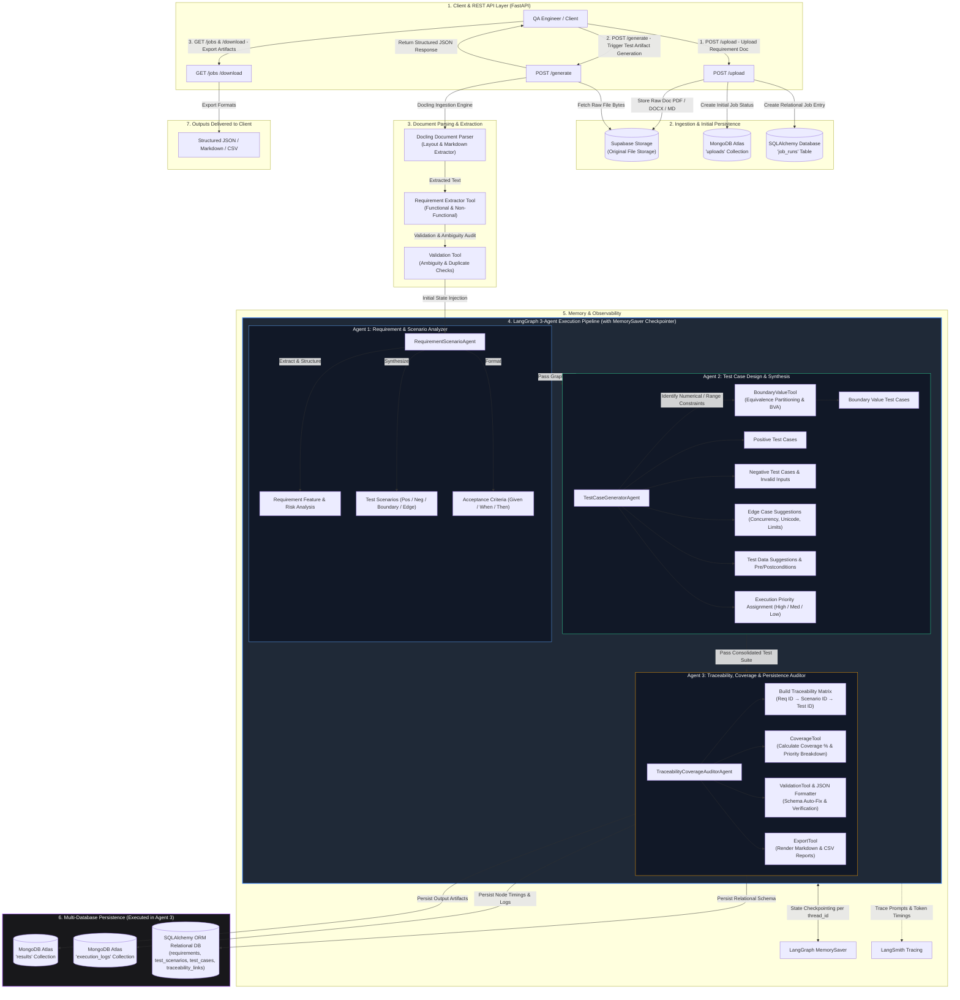

Nisha# System Architecture Flowchart

This document provides a visual flowchart representation of the **AI Test Engineering Assistant** working pipeline, covering document ingestion, parsing, the 3-agent LangGraph workflow, multi-database persistence, and report generation.

---

## Complete Working Flowchart

---

## Detailed Pipeline Stages

### Stage 1: Document Upload & Ingestion
1. Client issues `POST /upload` with a software requirement document (PDF, DOCX, Markdown).
2. The raw document content is saved into **Supabase Storage**.
3. Initial job metadata is recorded in **MongoDB Atlas** (`uploads` collection) and **SQLAlchemy DB** (`job_runs` table).

### Stage 2: Document Parsing & Validation
1. Client issues `POST /generate`.
2. **Docling Document Parser** processes the document layout into clean markdown text.
3. **Requirement Extractor Tool** parses functional and non-functional requirements.
4. **Validation Tool** audits requirements for ambiguity flags and duplicate entries.

### Stage 3: LangGraph 3-Agent Execution Pipeline
- **Agent 1 (`RequirementScenarioAgent`)**:
  Generates requirement risk analysis, high-level test scenarios (Positive, Negative, Boundary, Edge), and Given/When/Then acceptance criteria.
- **Agent 2 (`TestCaseGeneratorAgent`)**:
  Calls `BoundaryValueTool` for boundary analysis on numeric range constraints, generates full test cases (steps, expected results, test data, preconditions, postconditions, and High/Med/Low execution priorities).
- **Agent 3 (`TraceabilityCoverageAuditorAgent`)**:
  Builds Requirement-to-Test Traceability Matrix, computes coverage metrics via `CoverageTool`, auto-validates JSON payload via `ValidationTool`, renders Markdown/CSV reports via `ExportTool`, and saves data into MongoDB and SQLAlchemy databases.

### Stage 4: State Checkpointing & Tracing
- **LangGraph `MemorySaver`** checkpoints the state per thread/job ID across execution turns.
- **LangSmith Tracing** captures full trace graphs, prompts, node timings, and token metrics.

### Stage 5: Multi-Database Persistence
- **MongoDB Atlas**: Stores output result JSON (`results` collection) and timing execution logs (`execution_logs` collection).
- **SQLAlchemy ORM**: Populates relational entities (`requirements`, `test_scenarios`, `test_cases`, `traceability_links`, `execution_logs`) in SQLite or Supabase PostgreSQL.
